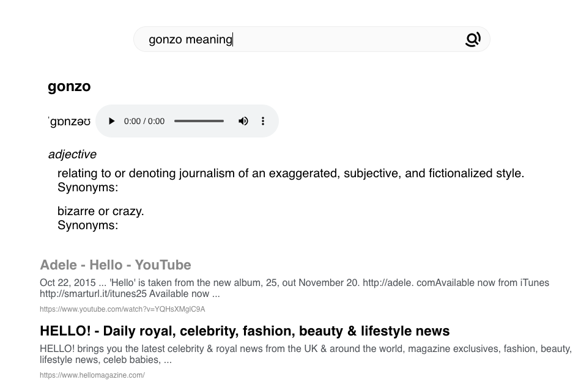
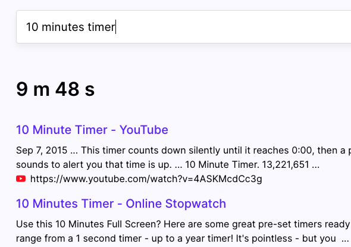
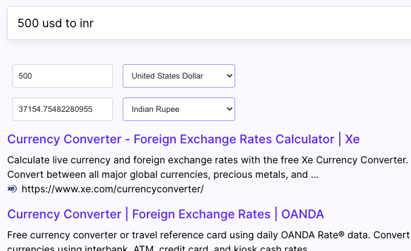
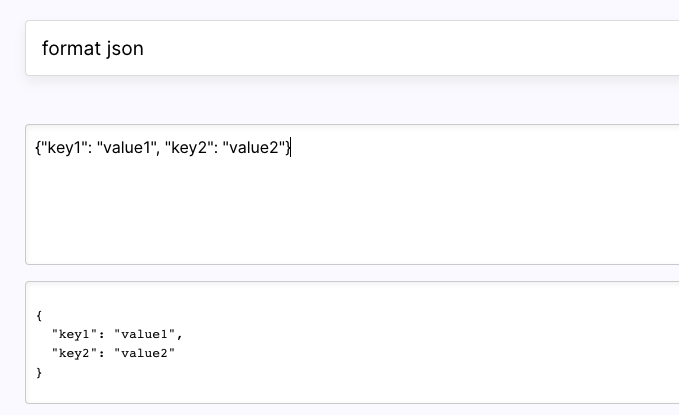

# Felvin Search - Instant Apps

> Your search box is now an app store! 🎉 - [Felvin](https://felvin.com)

<!-- Concern: Does this convey that these apps are running on a website? Gif is  -->

|                                                                                                                   |                                                                                                                 |
| ----------------------------------------------------------------------------------------------------------------- | --------------------------------------------------------------------------------------------------------------- |
| [](https://felvin.com/search?q=gonzo+meaning) | [](https://felvin.com/search?q=10+minutes+timer) |
| [](https://felvin.com/search?q=500+usd+to+inr)  | [](https://felvin.com/search?q=format+json)       |

[checkout more apps]() or even [create one for yourself]()!

## What are instant apps?

Instant apps are the small interactive cards which you get for your search queries.

> Search box is now an app store.

We can build instant apps for all kinds of use cases like dictionary, checking football scores, stock prices or notes from your notion or even search history from company slack or anything!

Try them out live - [neera.ai](https://neera.ai)

## Who can create instant apps?

You! Neera is a platform - create apps for yourself as well as others.

## Contributing

Try creating a new app, it's fun and it's a new kind of superpower. 😎

<!--
```sh
git clone ....
cd something
```
 -->

You could also contribute by suggesting a new instant app!

## How to create a Neera snippet app?

- Fork the repository
- Add a js/ts file with the app.
- Commit and send a pull request!

<!--- Insert a minute explainer --->

Checkout our [CONTRIBUTING](./CONTRIBUTING.md) guide for more details.

## Example Snippet Apps

- [Dictionary App](https://github.com/hargup/neera-snippet-apps/blob/master/src/SnippetApps/DictionaryApp.js)
- [Currency Conversion App](https://github.com/hargup/neera-snippet-apps/blob/master/src/SnippetApps/CurrencyConversionApp.js)
- [JSON Formatter App](https://github.com/Neera-AI/neera-snippet-apps/blob/master/src/SnippetApps/JSONFormatterApp.js)

## Anatomy of Snippet App

A snippet app is a Javascript object with following keys:

- `name`: String -> Name of the snippet app
- `id`: String
- `description`: String
- `logo`: Link to a PNG/SVG File
- `dataFetcher`: A function with input `{query: "<user query>"}` and ouput is any data you want to render.
- `renderer`: Its a React component with the data from `dataFetcher` passed a into `props.data`
